Building Bootable Multi-core Image and Debugging Multi-core on RT1180 for RT-Thread

# Chapter 1 Introduction

i.MX RT1180 Crossover MCUs are dual-core, real-time microcontrollers (MCUs) featuring an Arm® Cortex®-M7 and Arm® Cortex®-M33 for high performance and real-time functionality. The i.MX RT1180 CM7 operates at up to 800 MHz and the Arm Cortex-M33 up to 300 MHz with 1.5 MB on-chip RAM.

This document will demonstrate how to generate the bootable multi-core image. Also, will guide you on how to use DAPLink or JLink for multi-core debugging, including Keil and IAR.

In this document, MCUXpresso Secure Provisioning Tool (SEC) is used to generate the bootable multi-core image. Please refer to the detailed information in the i.MX RT1180 Reference Manual for multi-core boot.

The version of KEIL used in this document is 5.41.0.0

The version of IAR used in this document is 9.60.2

The version of board used in this AN is SCH-50577 REV C2.

The version of SEC used in this AN is 25.12.

# Chapter 2 The Bootable Image of Serial NOR Flash

MCUXpresso Secure Provisioning Tool (SEC) is an NXP GUI-based utility that simplifies secure image generation, device provisioning, and secure boot configuration for MCU devices. It enables developers to manage keys and certificates, sign and encrypt firmware images, configure security settings, and automate secure production workflows through both graphical and command-line interfaces.

In this document, SEC is just used to simplify the generation and provisioning of bootable executables on NXP i.MXRT1180 series platforms.

The bootable image of serial NOR flash includes the FlexSPI Config Block (FCB) and container.

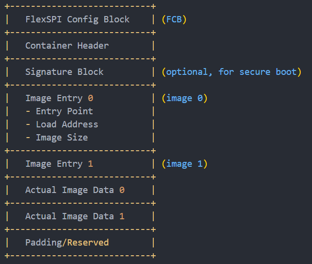

In MCUXpresso Secure Provisioning Tool (SEC), after selecting the NOR Flash, FCB will automatically configure the relevant parameters.

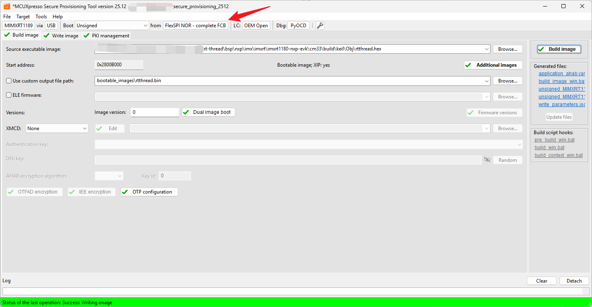

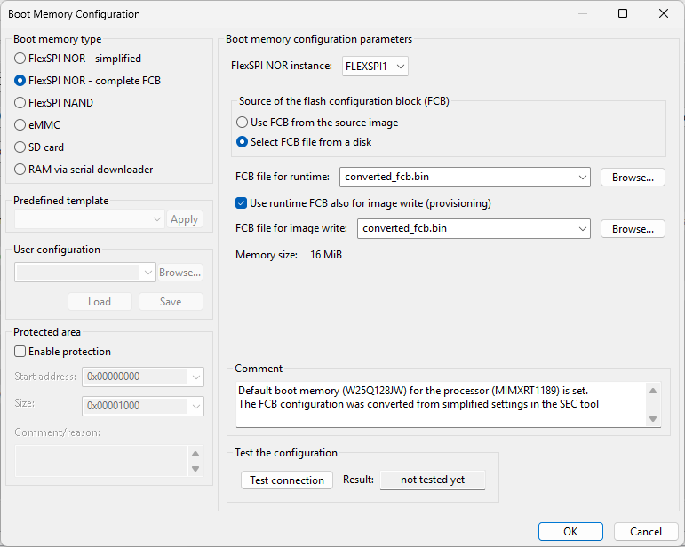

The generated FCB (offset is 0x400 byte) is as follows:

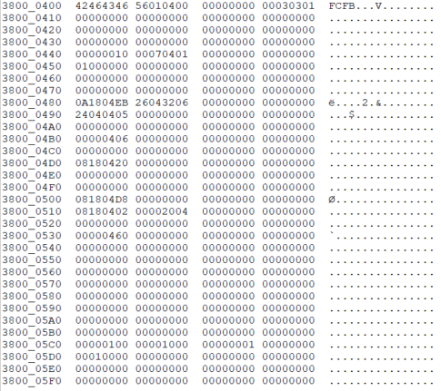

And, about the container part, we need to fill in the correct entry point and load address of image entry, for CM33 image and CM7 image. This section will be introduced in the next chapter.

The image container format consists of the following parts.

- Container header

- Image array entry

- Signature block

- User program images and data

The high-level view of the container format is shown in the following figure. Since we are not concerned with the encryption part, there is no need to configure the signature block in this document. For the more details of the container format, please refer to the iMXRT1180 Reference Manual: chapter 12.6.2 Container Format.

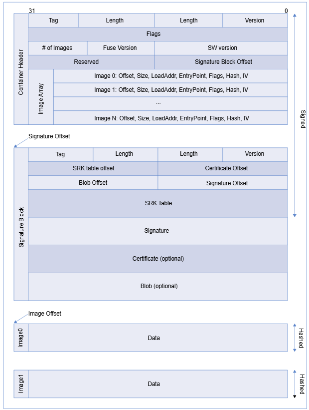

# Chapter 3 Building the Bootable Multi-core Image through SEC

For RT-Thread, enable multicore feature in menuconfig, both CM33 and CM7:

Hardware Drivers Config -> Onboard Peripheral Drivers -> Enable Multcore -> Enable CM33 Kick-off CM7

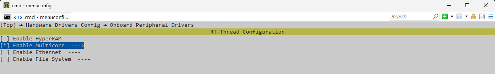

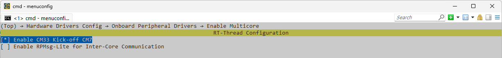

## 3.1 Case 1: The Cortex-M7 XIP image runs from NOR Flash and the Cortex-M33 XIP image runs from NOR Flash

In this case, the text start address of Cortex-M33 is 0x2800B000, and the text start address of Cortex-M7 is 0x28800000. The details are as follows:

- Choose the “FlexSPI NOR Flash” linker script in menuconfig, and generate KEIL or IAR project.

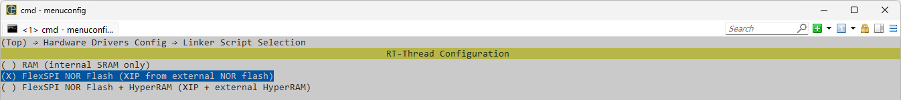

Such as in KEIL, in this time **MIMXRT1189xxxxx_cm33_flexspi_nor.scf** will be set automatically:

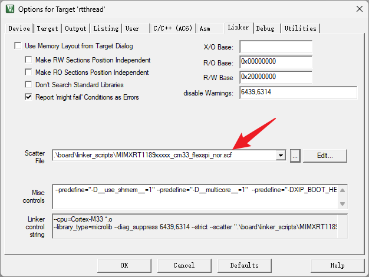

In **MIMXRT1189xxxxx_cm33_flexspi_nor.scf**, we can find the **load address** and **entry point** both are **0x2800B000**.

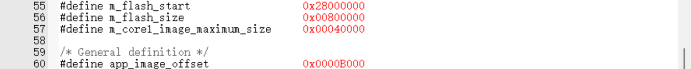

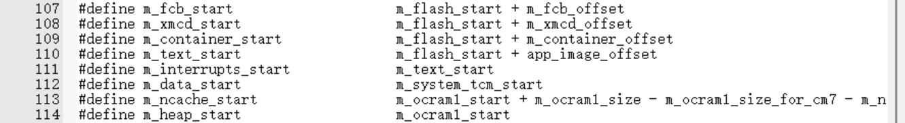

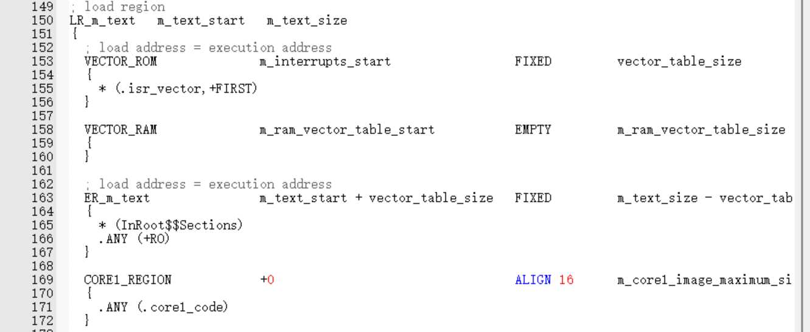

- Choose the “FlexSPI NOR Flash” linker script in menuconfig, and generate KEIL or IAR project.

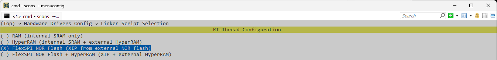

Such as in KEIL, in this time **MIMXRT1189xxxxx_cm7_flexspi_nor.scf** will be set automatically:

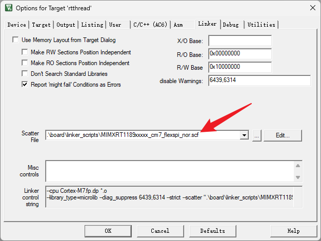

In **MIMXRT1189xxxxx_cm7_flexspi_nor.scf**, we can find the **load address** and **entry point** both are **0x28800000**:

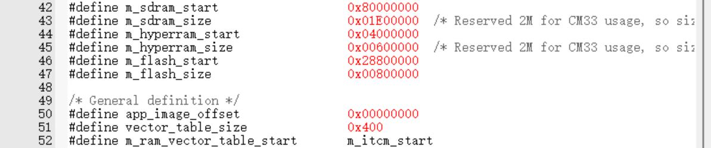

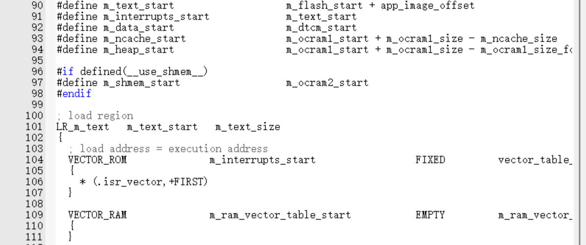

Then, in SEC, you can generate a bootable multi-core image according to the following steps:

1. Set the Source executable image (image for Cortex M33) in the Build tab.

2. Open the Additional User dialog via the Additional images button (the application binary image is automatically filled up).

3. Specify a standalone Cortex-M7 executable binary image running from the flash memory and set the following values: Image offset – 0x007FF000. It is calculated as: Load address (0x28800000) – FlexSPI NOR base address (0x28000000) – AHAB image offset in FlexSPI NOR (0x1000)

    - Load address: 0x28800000

    - Entry point: 0x28800000

    - Core ID: cortex-m7

    - Image type: executable

4. Close the dialog by clicking the OK button.

5. Click the Build image button.

Download the image through USB_OTG1 (serial download). After reset the board, the log below shows the output of the image in the CM33 terminal window:

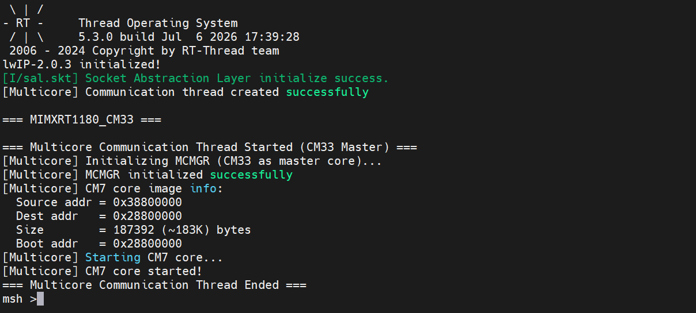

And CM7 terminal window:

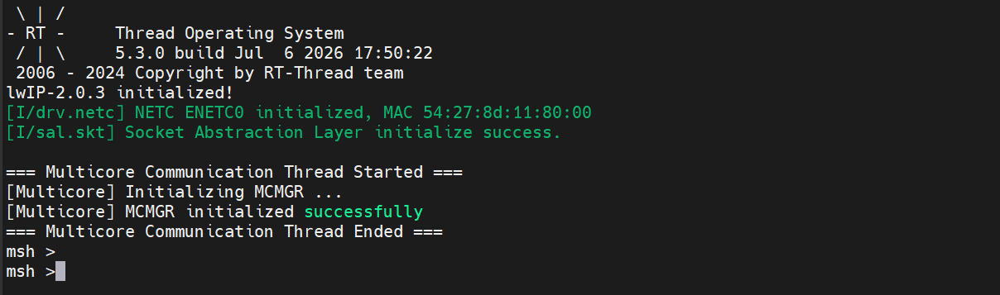

Read back the image in the NOR flash, we can find the container, which the start offset is 0x1000 byte:

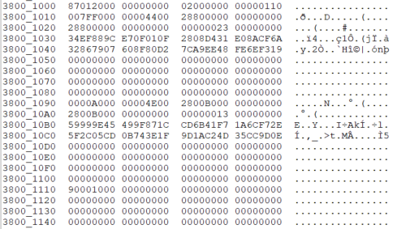

The analysis of container is as follows:

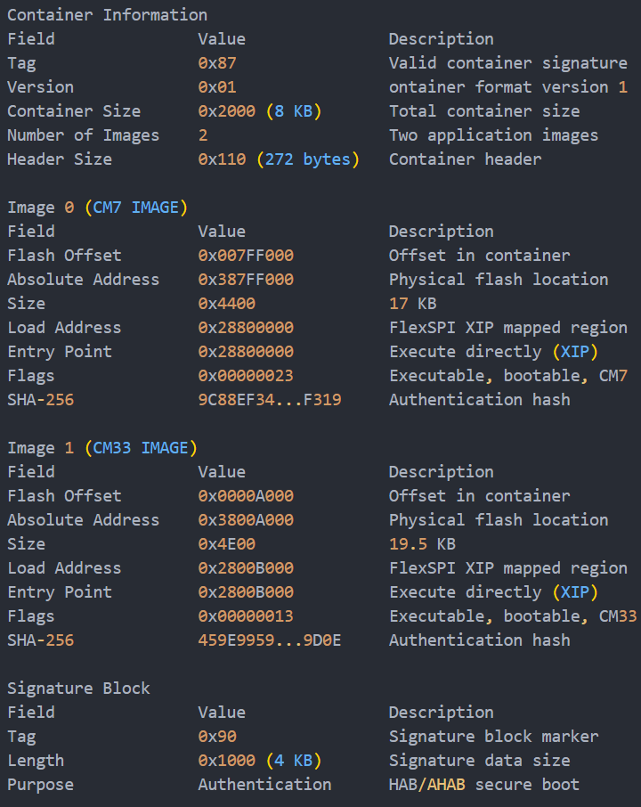

## 3.2 Case 2: The Cortex-M7 image runs from internal ITCM RAM and the Cortex-M33 XIP image runs from external flash

In this case, the start address of Cortex-M7 is 0x00000000 and the start address of Cortex-M33 is 0x2800B000. The image of CM7 will be copied from flash to ITCM by CM33. Similarly, the details are as follows:

- Choose the “FlexSPI NOR Flash” linker script in menuconfig, and generate KEIL or IAR project.

Such as in KEIL, in this time **MIMXRT1189xxxxx_cm33_flexspi_nor.scf** will be set automatically:

- Choose the “FlexSPI NOR Flash” linker script in menuconfig, and generate KEIL or IAR project.

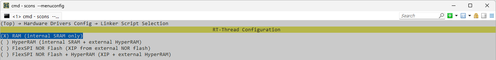

Such as in KEIL, in this time **MIMXRT1189xxxxx_cm7_ram.scf** will be set automatically:

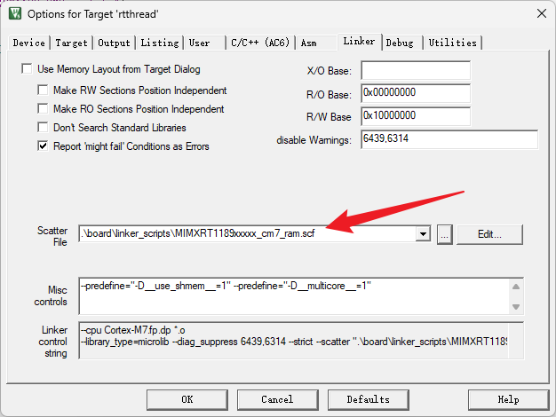

Then, in SEC, you can generate a bootable multi-core image according to the following steps:

1. Set the Source executable image (image for Cortex M33) in the Build tab.

2. Open the Additional User dialog via the Additional images button (the application binary image is automatically filled up).

3. Specify a standalone Cortex M7 executable binary image running from ITCM RAM and set the following values:

    - Image offset – 0x007FF000 – this can be any value which does not overlap with other image (in this example the image was placed directly after the Cortex M33 image)

    - Load address – 0x28800000 (ROM will not copy the CM7 image)

    - Entry point – 0x0 (the start addresses of the image in the CM7 address space)

    - Core ID – cortex-m7

    - Image type – executable

4. Close the dialog by clicking the OK button.

5. Click the Build image button.

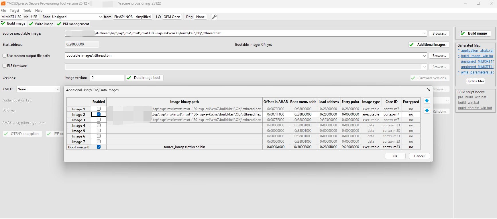

Download the image through USB_OTG1 (serial download). After reset the board, the log below shows the output of the image in the CM33 terminal window:

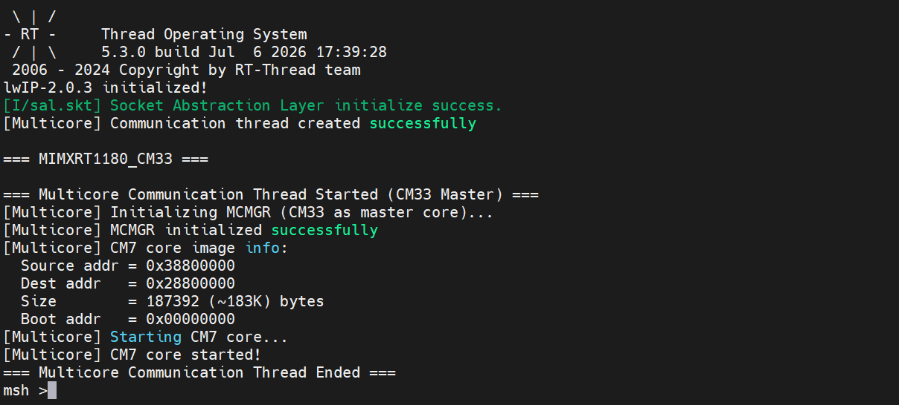

And the CM7 terminal window:

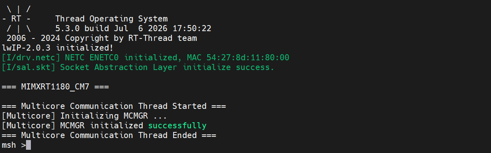

To have the Boot ROM copy the CM7 image, please follow the steps below:

1. Set the Source executable image (image for Cortex M33) in the Build tab.

2. Open the Additional User dialog via the Additional images button (the application binary image is automatically filled up).

3. Specify a standalone Cortex M7 executable binary image running from ITCM RAM and set the following values:

    - Image offset – 0x007FF000 – this can be any value which does not overlap with other image (in this example the image was placed directly after the Cortex M33 image)

    - Load address – 0x303C0000 (secured alias of CM7 ITCM in the CM33 core address space)

    - Entry point – 0x0 (the start addresses of the image in the CM7 address space)

    - Core ID – cortex-m7

    - Image type – executable

4. Close the dialog by clicking the OK button.

5. Open the OTP Configuration dialog by clicking the OTP configuration button in the left-bottom corner.

6. Set POR_PRELOAD_CM7_TCM_ECC and RELEASE_M7_RST_STAT fuses (BOOT_CFG7) to 1.

7. Close the dialog via the OK button.

8. Click the Build image button.

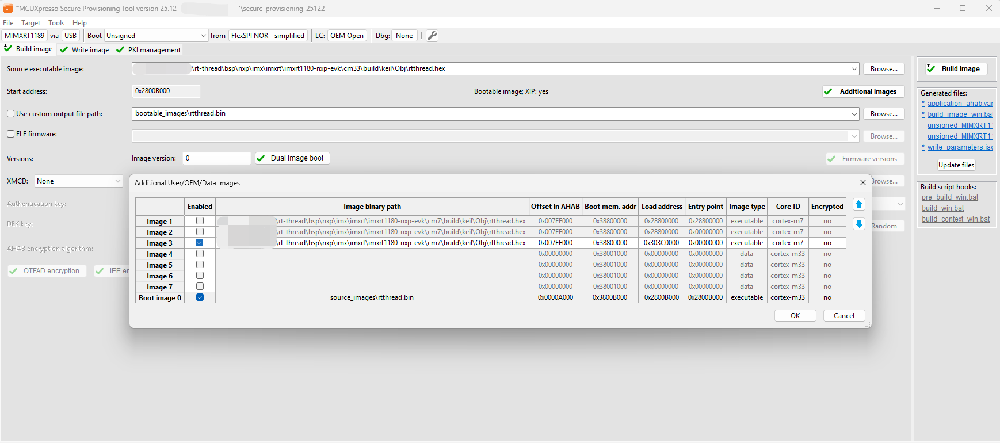

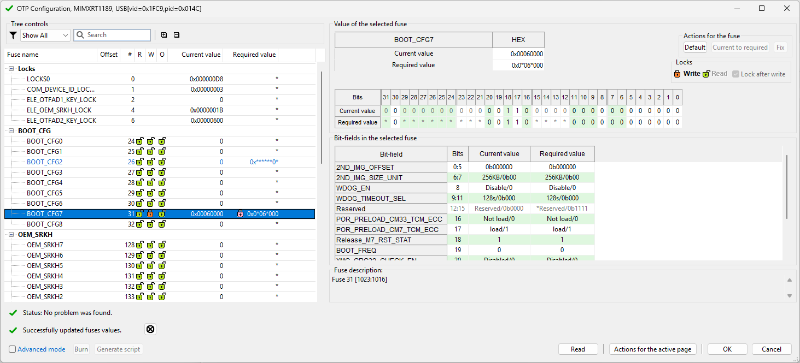

## 3.3 Case 3: The Cortex-M7 image runs from internal ITCM RAM and the Cortex-M33 XIP image also runs from internal TCM RAM

In this case, the start address of Cortex-M7 is 0x00000000 and the start address of Cortex-M33 is 0x0FFE0000. The image of CM33 will be copied from flash to TCM by ROM. And the image of CM7 will be copied from flash to ITCM by CM33. Similarly, the details are as follows:

- Choose the “RAM” linker script in menuconfig, and generate KEIL or IAR project.

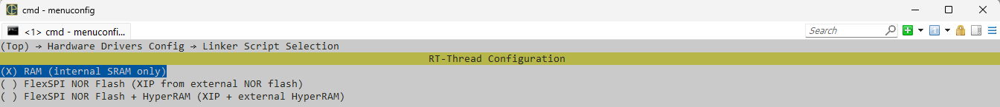

Such as in KEIL, in this time **MIMXRT1189xxxxx_cm33_ram.scf** will be set automatically:

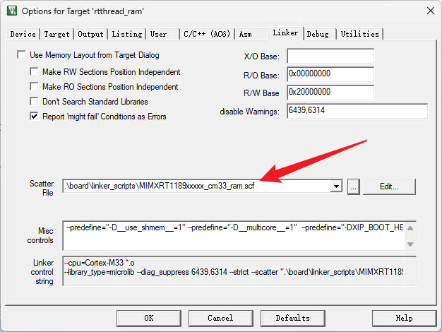

- Choose the “RAM” linker script in menuconfig, and generate KEIL or IAR project.

Such as in KEIL, in this time **MIMXRT1189xxxxx_cm7_ram.scf** will be set automatically:

Then, in SEC, you can generate a bootable multi-core image according to the following steps:

1. Set the Source executable image (image for Cortex M33) in the Build tab.

2. Open the Additional User dialog via the Additional images button (the application binary image is automatically filled up).

3. Specify a standalone Cortex M7 executable binary image running from ITCM RAM and set the following values:

    - Image offset – 0x007FF000 – this can be any value which does not overlap with other image (in this example the image was placed directly after the Cortex M33 image)

    - Load address – 0x28800000 (ROM will not copy the CM7 image)

    - Entry point – 0x0 (the start addresses of the image in the CM7 address space)

    - Core ID – cortex-m7

    - Image type – executable

4. Close the dialog by clicking the OK button.

5. Click the Build image button.

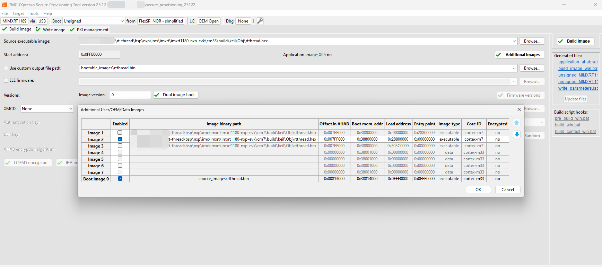

Download the image through USB_OTG1 (serial download). After reset the board, the log will not be repeated here.

## 3.4 Case 4: The Cortex-M7 image runs from external flash and the Cortex-M33 XIP image runs from internal TCM RAM

In this case, the start address of Cortex-M7 is 0x28800000 and the start address of Cortex-M33 is 0x0FFE0000. The image of CM33 will be copied from flash to TCM by ROM. Similarly, the details are as follows:

- Choose the “RAM” linker script in menuconfig, and generate KEIL or IAR project.

Such as in KEIL, in this time **MIMXRT1189xxxxx_cm33_ram.scf** will be set automatically:

- Choose the “FlexSPI NOR Flash” linker script in menuconfig, and generate KEIL or IAR project.

Such as in KEIL, in this time **MIMXRT1189xxxxx_cm7_flexspi_nor.scf** will be set automatically:

Then, in SEC, you can generate a bootable multi-core image according to the following steps:

1. Set the Source executable image (image for Cortex M33) in the Build tab.

2. Open the Additional User dialog via the Additional images button (the application binary image is automatically filled up).

3. Specify a standalone Cortex M7 executable binary image running from flash and set the following values:

    - Image offset – 0x007FF000 – this can be any value which does not overlap with other image (in this example the image was placed directly after the Cortex M33 image)

    - Load address – 0x28800000 (ROM will not copy the CM7 image)

    - Entry point – 0x28800000 (the start addresses of the image in the CM7 address space)

    - Core ID – cortex-m7

    - Image type – executable

4. Close the dialog by clicking the OK button.

5. Click the Build image button.

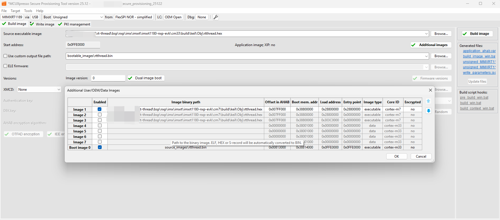

Download the image through USB_OTG1 (serial download). After reset the board, the log will not be repeated here.

Similarly, the bootable multi-core image combined by CM33 and CM7 generated by IAR will not be repeated in detail here.

# Chapter 4 Debugging Multi-core Using KEIL and IAR

This chapter will demonstrate you how to use DAPLink and JLink to debug multi-core image in KEIL and IAR.

## 3.1 Using KEIL

The bootable multi-core image used here is same with the case 1 in Chapter 2. It should be noted that you cannot load individual image of CM33 or CM7 into flash during debugging now. Therefore, the debugger needs to attach to running program. In KEIL, there is no **attach to Running Target** and **Debug without Downloading** for debugger, but you can config the IDE as followed:

- Disable Load Application at Startup in Debug window.

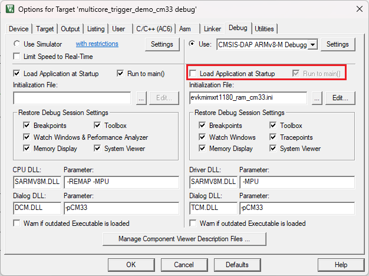

- Disable Update Target before Debugging in Utilities window.

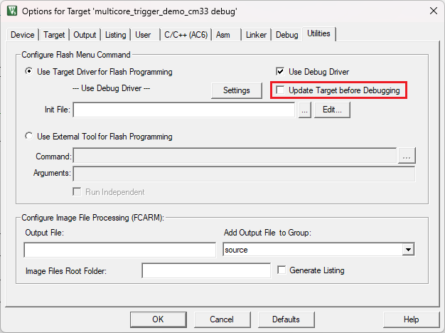

Now, you can debug multi-core image under the CM33 and CM7 projects.

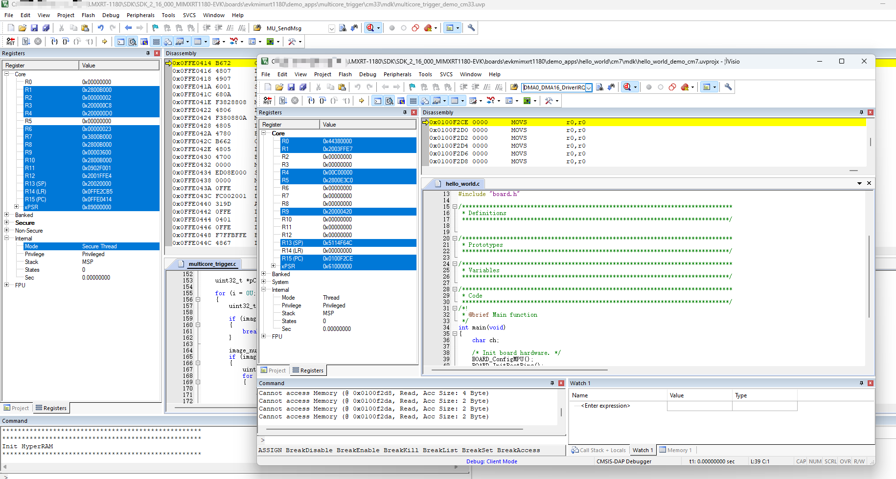

Run the CM33 codes firstly, and then run the CM7 codes.

Similarly, the debugging for the image of case 2 in Chapter 3 is consistent with the above.

The configuration of DAPlink is shown in the figure below for reference:

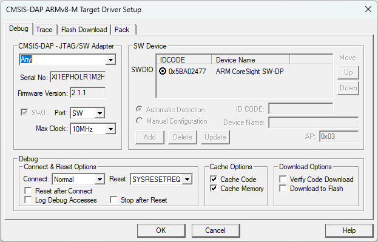

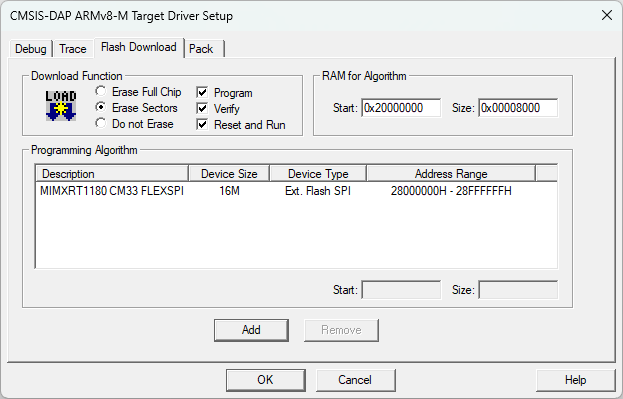

The configuration of Jlink is shown in the figure below for reference:

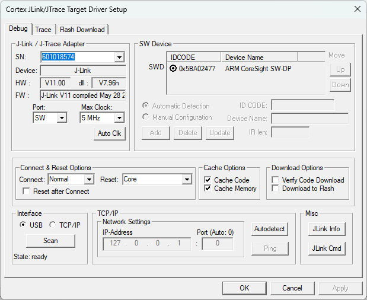

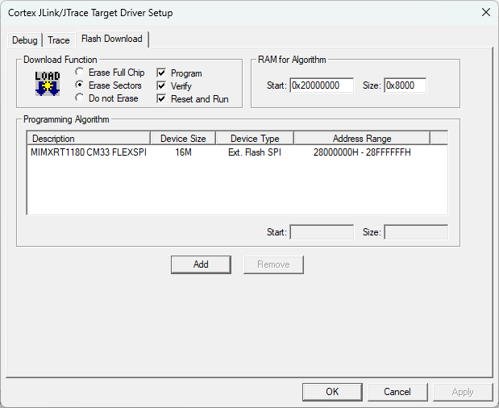

## 3.2 Using IAR

The bootable multi-core image used here is same with the case 1 in Chapter 2.

In IAR, there are **Attach to Running Target** and **Debug without Downloading** for debugger. So, it will be more convenient than KEIL.

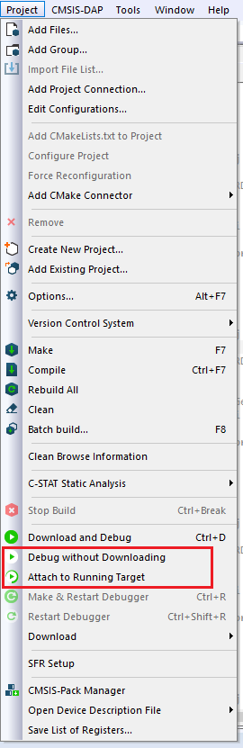

In IAR, there is no difference between DAPlink and Jlink. You need to config the CM33 project into **Asymmetric Multicore** mode. The configuration of DAPlink and Jlink is shown in the figure below for reference:

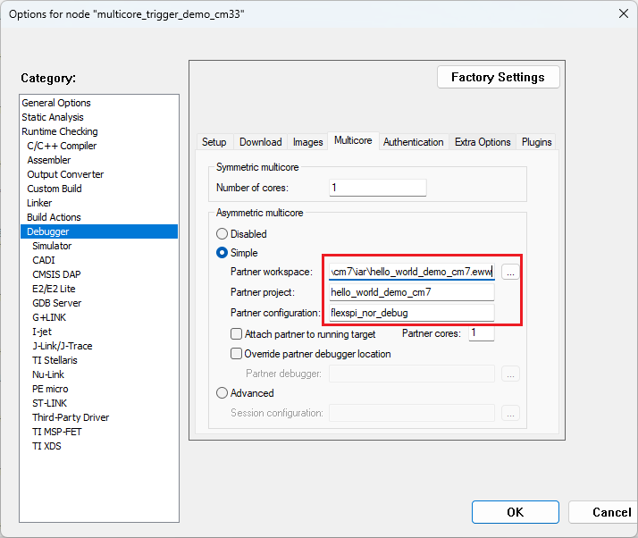

Then if you start **Attach to Running Target** or **Debug without Downloading** in CM33 project. It will open the CM7 project in partner mode.

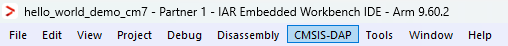

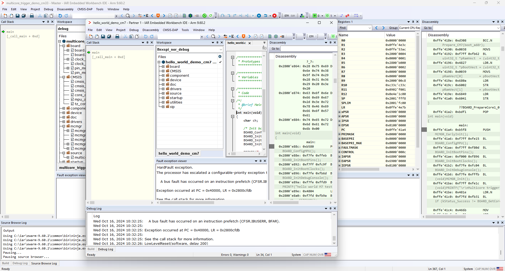

Similarly, run the CM33 codes firstly, and then run the CM7 codes, the log result will be same with debugging in KEIL.

**Note**: If you want to change debugger (such as from DAPlink to Jlink), you need change it both in CM33 and CM7 project and save it.

# Chapter 4 Conclusion

This document uses demo (separate CM33 and CM7 project) from SDK to demonstrate that build a bootable multi-core image for RT1180. And this document introduce how to use three different IDEs for multi-core debugging.

